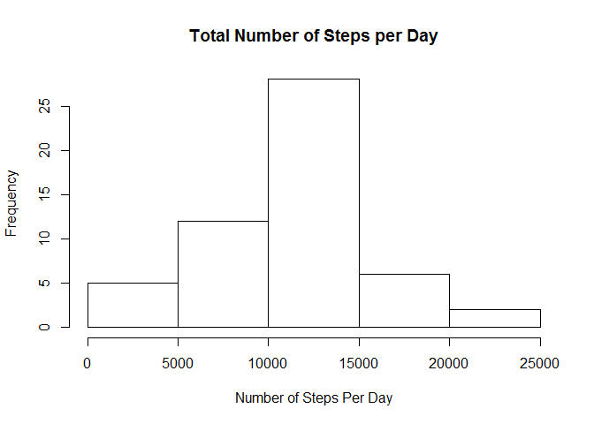
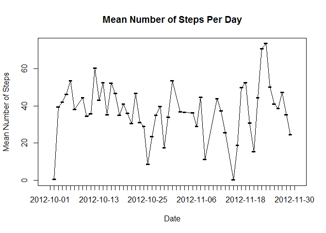
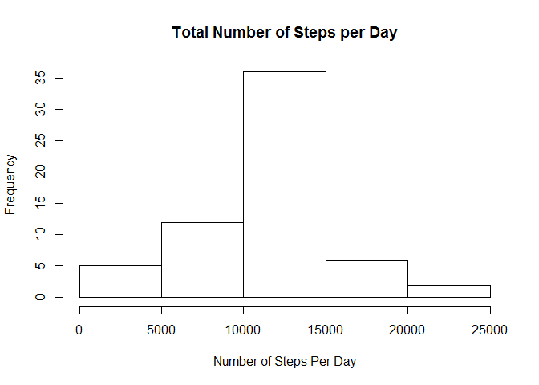
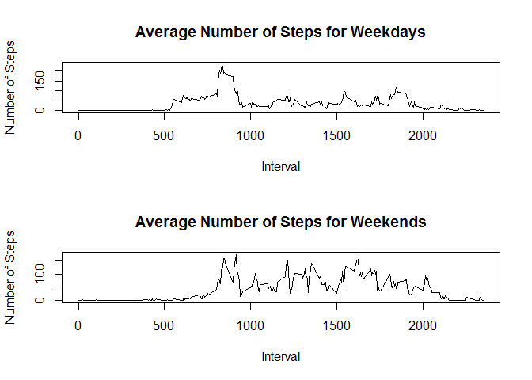

# PA1_template
Kenneth Moffett  
January 9, 2016  

# This Report will answer the questions for Course Project One for the Reproducible Research Course.

This report presumes two things: 1) The activity csv has been unzipped; and 2) The plyr, dplyr, reshape2, and lubridate packages have been installed on your machine. If these packages have not been installed, then this R Markdown file will not run correctly.

## Question One: Loading the Data and Required Packages


```r
# Load the Data

data <- read.csv("activity.csv", header =  TRUE)

# Load Required Packages

library(plyr)
library(dplyr)
```

```
## 
## Attaching package: 'dplyr'
```

```
## The following objects are masked from 'package:plyr':
## 
##     arrange, count, desc, failwith, id, mutate, rename, summarise,
##     summarize
```

```
## The following objects are masked from 'package:stats':
## 
##     filter, lag
```

```
## The following objects are masked from 'package:base':
## 
##     intersect, setdiff, setequal, union
```

```r
library(reshape2)
library(lubridate)
```

```
## 
## Attaching package: 'lubridate'
```

```
## The following object is masked from 'package:plyr':
## 
##     here
```

## Question Two: Generating a Histogram to Compute the Number of Steps Per Day


```r
## Generate Dataset Containing Total Number of Steps in Each Day

totalsteps <- ddply(data, .(date), summarize, sum = sum(steps))

## Generate Histogram

hist(totalsteps$sum, main = "Total Number of Steps per Day", ylab = "Frequency", xlab = "Number of Steps Per Day")
```

\

```r
dev.off()
```

```
## null device 
##           1
```

## Question Three: Compute the Mean and Median Number of Steps Per Day


```r
mean(totalsteps$sum, na.rm = TRUE)
```

```
## [1] 10766.19
```

```r
median(totalsteps$sum, na.rm = TRUE)
```

```
## [1] 10765
```

The mean number of steps per day is 10766.19. The median number of steps per day is 10765.

## Question Four: Generate Time-Series Plot of the Mean Number of Steps Taken Per Day


```r
## Generate Dataset with Mean Number of Steps by Date

meansteps <- ddply(data, .(date), summarize, sum = mean(steps))

## Omit NAs from The Data to Eliminate Days with No Data (Eliminates Breaks in the Graph)

cleanmeansteps <- na.omit(meansteps)

## Generate Plot

plot(cleanmeansteps$date, cleanmeansteps$sum, type = "l", ylab = "Mean Number of Steps", xlab = "Date", main = "Mean Number of Steps Per Day")
lines(cleanmeansteps$date, cleanmeansteps$sum)
```

\

```r
dev.off()
```

```
## null device 
##           1
```

## Question Five: Discover which Five-Minute Interval contains the Highest Number of Steps across All Days on Average


```r
## Generate Dataset with Number of Steps by Interval

### Omit NAs in the Data or Else Computation Does NOT Work

cleandata <- na.omit(data)

### Generate Dataset

intervalsteps <- ddply(cleandata, .(interval), summarize, sum = mean(steps))

## Obtain Interval Identifier for the Number of Steps Across Intervals

subintervalsteps <- subset(intervalsteps, intervalsteps$sum == max(intervalsteps$sum))
print(subintervalsteps)
```

```
##     interval      sum
## 104      835 206.1698
```

The interval with the highest number of steps is interval 835, with the maximum number of steps being 206.1698.

## Question Six: Provide Code that Imputes the Missing Data


```r
## Generate New Dataset for Imputation

data2 <- data

## Impute Values in New Dataset

data2$steps[which(is.na(data2$steps))] <- mean(data$steps, na.rm = TRUE)
```

In this case, I replaced each missing value for steps to be the mean of steps using the unimputed data.

## Question Seven: Generate a Histogram of the Total Number of Steps Using the Imputed Data


```r
## Generate Total Number of Steps in Imputed Data

totalsteps2 <- ddply(data2, .(date), summarize, sum = sum(steps))

## Generate Histogram Using Imputed Data

hist(totalsteps2$sum, main = "Total Number of Steps per Day", ylab = "Frequency", xlab = "Number of Steps Per Day")
```

\

```r
dev.off()
```

```
## null device 
##           1
```

##Question Eight: Generate a Panel plot that Compares the Average Number of Steps Taken per 5-minute Interval Across Weekdays and Weekends


```r
## Generate Factor Variable for Weekends and Weekdays

data$date <- ymd(data$date)
data$weekday <- wday(data$date)
data$sunday <- as.numeric(data$weekday==1)
data$saturday <- as.numeric(data$weekday==7)
data$daytype <- data$saturday + data$sunday
data$daytype <- factor(data$daytype, labels = c("weekday", "weekend"))

## Generate Datasets by Day Type

weekenddata <- subset(data, daytype=="weekend")
weekdaydata <- subset(data, daytype=="weekday")

## Generate Two Datasets by Interval

### Omit NAs in the Data or Else Computation Does NOT Work

cleanweekenddata <- na.omit(weekenddata)
cleanweekdaydata <- na.omit(weekdaydata)

### Generate Datasets

weekdayintervalsteps <- ddply(cleanweekdaydata, .(interval), summarize, sum = mean(steps))
weekendintervalsteps <- ddply(cleanweekenddata, .(interval), summarize, sum = mean(steps))

## Generate Plots

par(mfcol = c(2,1))

### Top Plot

plot(weekdayintervalsteps$interval, weekdayintervalsteps$sum, type = "n", ylab = "Number of Steps", xlab = "Interval", main = "Average Number of Steps for Weekdays")
lines(weekdayintervalsteps$interval, weekdayintervalsteps$sum)

### Bottom Plot

plot(weekendintervalsteps$interval, weekendintervalsteps$sum, type = "n", ylab = "Number of Steps", xlab = "Interval", main = "Average Number of Steps for Weekends")
lines(weekendintervalsteps$interval, weekendintervalsteps$sum)
```

\

```r
dev.off()
```

```
## null device 
##           1
```

## Question Nine: Provide All of the R Code Necessary to Generate the Report

This code has been provided throughout the report.
